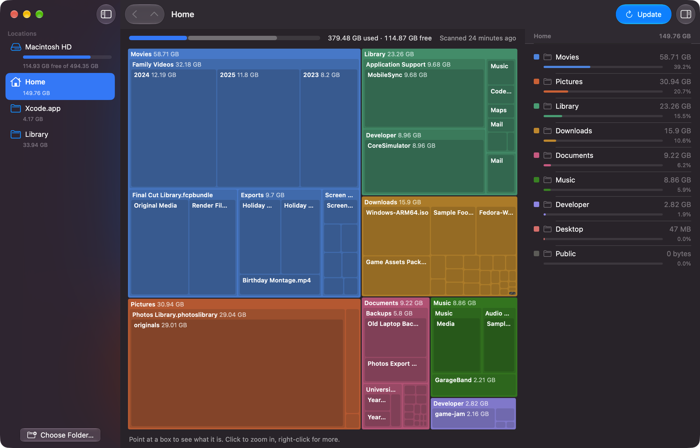
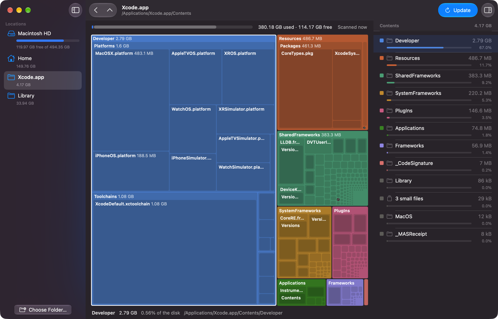
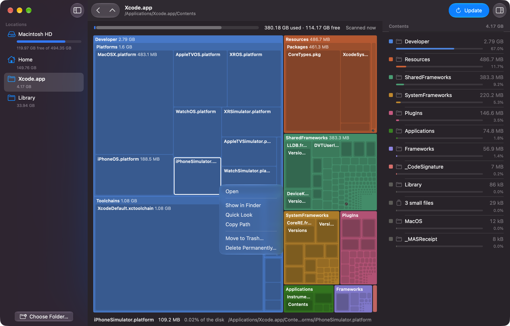
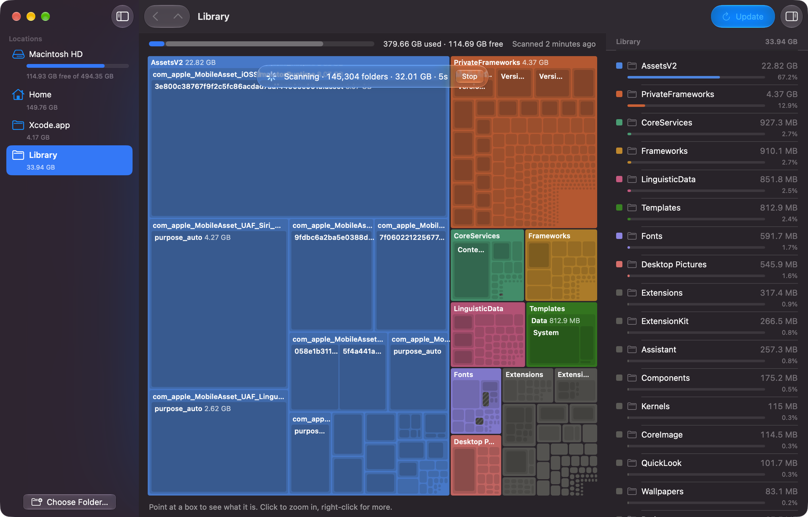
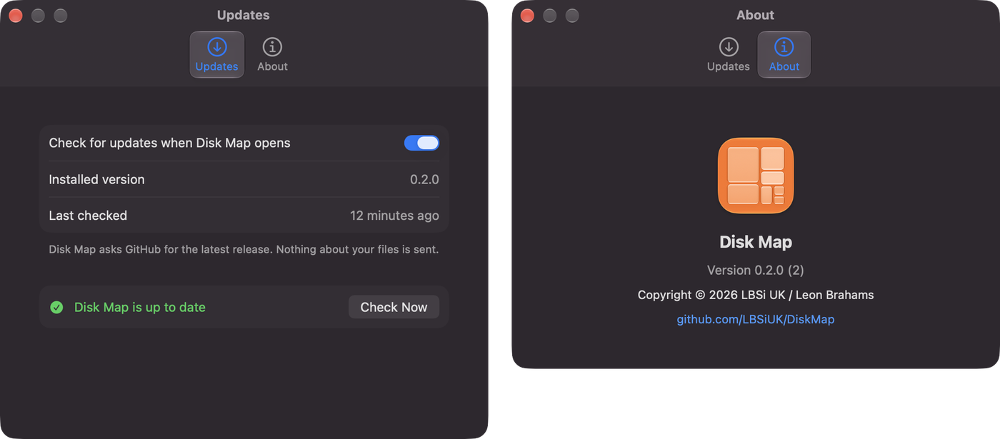
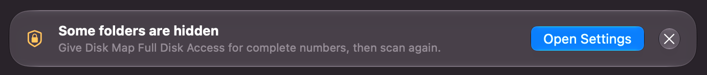
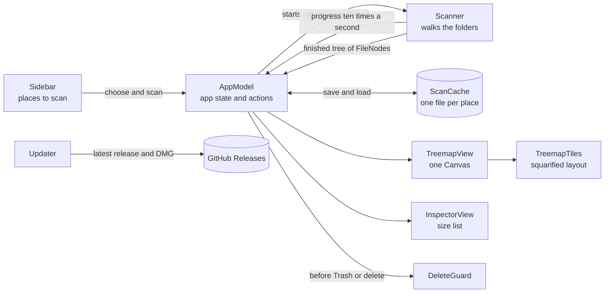

# Disk Map

A small Mac app that shows what's filling up your disk, in the spirit of WizTree and WinDirStat.

If your Mac keeps warning that the disk is nearly full, Finder isn't much help working out why. Disk Map scans a drive or folder and draws every folder as a box sized by how much space it takes up, so the big things stand out straight away. Click a box to zoom in, right-click it to show it in Finder, Quick Look it, or get rid of it.



*A scanned home folder. The sidebar holds the places you can scan, the list on the right shows the current folder biggest first.*

The screenshots use demo data: a made-up home folder, plus Xcode and `/System/Library`.

| | |
| --- | --- |
|  |  |
| *Zoomed in. Point at a box to see its size, share of the disk and path.* | *Right-click any box or list row for actions.* |
|  |  |
| *Rescanning. The old map stays up until the new one is ready.* | *Settings: update checks and the About pane.* |

## Features

- Treemap of any drive or folder, a few levels deep, with a size list sorted biggest first
- Fast background scanning that you can stop at any time
- Show in Finder, Quick Look (or press Space) and Copy Path
- Move to Trash or delete permanently, both with a confirmation first
- Refuses to remove the drive itself, system folders or your home folder
- The map updates straight away after you delete something, no rescan needed
- Remembers your last scan of each place, so it opens straight to the results
- Add any folder to the sidebar
- Checks GitHub for new versions and can update itself (you can turn this off)
- Native Liquid Glass design, in light and dark mode

## Installing

Download the latest `.dmg` from [Releases](https://github.com/LBSiUK/DiskMap/releases), open it and drag Disk Map into Applications.

The builds aren't notarised yet, so the first time you open it macOS will say it can't check it for malware. Try to open it once, then go to System Settings → Privacy & Security, scroll down and click Open Anyway. You only need to do this once.

After that the app checks for new versions when it opens and can update itself. You can turn this off in Settings, or check by hand from the Disk Map menu.

### A note on permissions

macOS hides some folders from apps unless they have Full Disk Access. Disk Map works without it, but the numbers will be more complete if you turn it on in System Settings → Privacy & Security → Full Disk Access. If access is missing, the app tells you and has a button that opens the right page:



## Building it yourself

You'll need macOS 26 or later, Xcode 26 or later and [XcodeGen](https://github.com/yonaskolb/XcodeGen). The Xcode project isn't checked in; XcodeGen makes it from `project.yml`.

```
brew install xcodegen
git clone https://github.com/LBSiUK/DiskMap.git
cd DiskMap
./build.sh
```

`build.sh` builds a Release copy and copies it to `/Applications`, replacing any copy already there.

To build and run it without installing:

```
xcodegen generate
xcodebuild -project DiskMap.xcodeproj -scheme DiskMap -configuration Release -derivedDataPath build/DerivedData build
open "build/DerivedData/Build/Products/Release/Disk Map.app"
```

Or run `xcodegen generate`, open `DiskMap.xcodeproj` and press Run. A copy you build yourself shares its settings and saved scans with an installed copy, as they have the same bundle identifier.

To run the tests:

```
xcodebuild -project DiskMap.xcodeproj -scheme DiskMap test
```

Builds are signed to run locally by default. To sign with your own certificate, see the note at the top of `Config/Base.xcconfig`. `make-dmg.sh` packages the app as a drag-to-install DMG in `build/`, and can sign and notarise it if you have a Developer ID (the steps are at the top of the script).

## How it works



- **Scanning.** `Scanner` walks the folder with `getattrlistbulk`, which returns a whole folder's names, types and sizes in one call. The top few levels are scanned in parallel. It stays on one drive, doesn't follow symbolic links, counts hard-linked files once, and notes folders it isn't allowed to read instead of getting stuck.
- **The tree.** The result is a tree of `FileNode`s. Every folder is kept, but only files over 1 MB get their own node. The smaller files in each folder are grouped into one "small files" box, which keeps memory low on big drives.
- **Saving.** `AppModel` keeps the results for each place and saves them in the background with `ScanCache`, a compact binary format in `~/Library/Application Support/Disk Map/Scans`. Next time the app opens straight to the last scan.
- **Drawing.** `TreemapTiles` lays out the current folder with the squarified treemap algorithm, nesting up to three levels, and `TreemapView` draws every box in a single `Canvas` so it stays smooth with tens of thousands of boxes. The layout is cached, so hovering doesn't redo it.
- **Deleting.** Before anything goes to the Trash or is deleted, `DeleteGuard` checks it isn't the scanned folder, a system folder or your home folder. Afterwards the item is taken out of the tree and the sizes above it are updated, so there's no need to rescan.
- **Updates.** `Updater` asks the GitHub Releases API for the latest release (tag `vX.Y.Z` with a `.dmg` attached). If it's newer, it downloads the DMG, checks the app inside is Disk Map at the expected version with a valid signature, swaps it in and reopens.

The design is written up in more detail in [`docs/design.md`](docs/design.md).

### Project layout

| Path | What's there |
| --- | --- |
| `DiskMap/App` | App entry point, menu commands and the About panel |
| `DiskMap/Model` | `AppModel`, the `FileNode` tree, `ScanCache`, `DeleteGuard`, `Updater` and sidebar locations |
| `DiskMap/Scanner` | The folder walker |
| `DiskMap/Layout` | Squarified layout and treemap tiles |
| `DiskMap/Views` | SwiftUI views: sidebar, treemap, size list, banners and Settings |
| `DiskMap/Resources` | App icon and asset catalogue |
| `DiskMapTests` | Unit tests (Swift Testing) |
| `Config/Base.xcconfig` | Signing settings |
| `project.yml` | XcodeGen project definition |
| `build.sh` | Builds a Release copy and installs it to `/Applications` |
| `make-dmg.sh` | Builds the app and packages it as a DMG |
| `docs/design.md` | Design notes |

## Status

Early days, but it works. Things to know:

- The builds aren't notarised, so macOS asks you to approve the app the first time (see [Installing](#installing)).
- It isn't sandboxed, as it needs to read the whole drive and delete files.
- Without Full Disk Access some folders are hidden, so the totals will be lower than the space actually used.
- Not done yet: a menu bar item and search.

## Credits

Copyright © 2026 LBSi UK / Leon Brahams

https://github.com/LBSiUK/DiskMap
